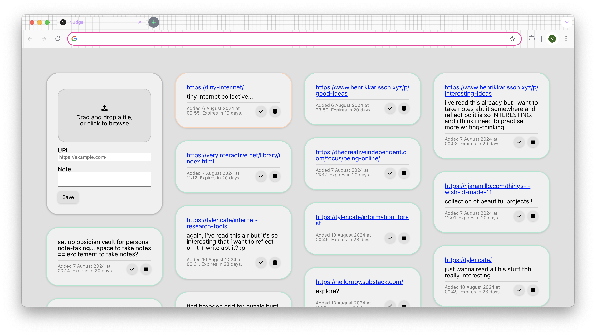

# Nudge



A Google Chrome new tab extension that saves links, images, and other content for future processing. To prompt you to process your saved items, Nudge:

- Reminds you how long it's been since you last saved a particular item
- Displays your saved items every time you open a new tab, making them unavoidable
- Removes saved items after 30 days

Nudge is written using Vite + React in Typescript. It stores all your data client-side in IndexedDB.

## Why?

I save things I want to take a look at later in lots of places: Twitter bookmarks, Reddit saved posts, sending them to myself on Telegram... but my bookmarks are not in-your-face enough, so I never actually look at them again, and all the cool interesting things I wanted to check out end up rotting away in the depths of my Telegram Saved Messages chat.

Nudge was created to stop myself from endlessly collecting things and never actually looking at them. It does two things: (1) makes my bookmarks easier to access and (2) brings in an element of pressure to force me to clear them.

(1) is accomplished by Nudge being a a new tab extension, so all your bookmarks appear whenever you open a new tab. (I personally have a problem where I open new tabs unthinkingly even if I don't need them just out of sheer boredom, so hijacking that behaviour to force me to confront everything I said I would read.) (2) is accomplished by saved items being automatically removed after 30 days. The colour of the card changes every ten days as well as a sort of visual countdown, so you are faced with the fact that time is running out and that you have neglected your saved items for a terribly long amount of time.

Note that Nudge is **not** a long-term storage space. It is **not** a tool for you to organise your saved items—that's why, as of time of writing, there is no option to drag your cards around, group them, or sort them. Nudge is a tool to force you to **look at your saved items and do something with them**.

## Really?

At time of writing I've been using Nudge for about ten days or so. It _has_ actually helped with going through the things I wanted to check out. As time passes I'll look into adding more features that I find that I need, as well as improving the visual design of the extension.

## Setup

1. Clone this repository.

   ```shell
   git clone https://github.com/valerietanhx/nudge.git
   ```

2. Navigate to the repository folder.

   ```shell
   cd nudge
   ```

3. Install the dependencies.

   ```shell
   npm install
   ```

4. Build the extension.

   ```shell
   npm run build
   ```

5. Navigate to Chrome's Extensions page. You can do this either by going to chrome://extensions/, or by clicking the three-dot menu in the top-right corner of the browser, selecting Extensions, then clicking Manage Extensions.

6. Enable Developer Mode in the Extensions page.

7. Click the "Load Unpacked" button and select the dist/ folder in the repository folder.

The Nudge page should now appear when you open a new tab.
